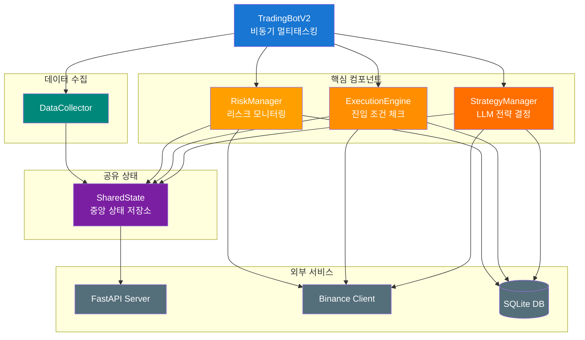
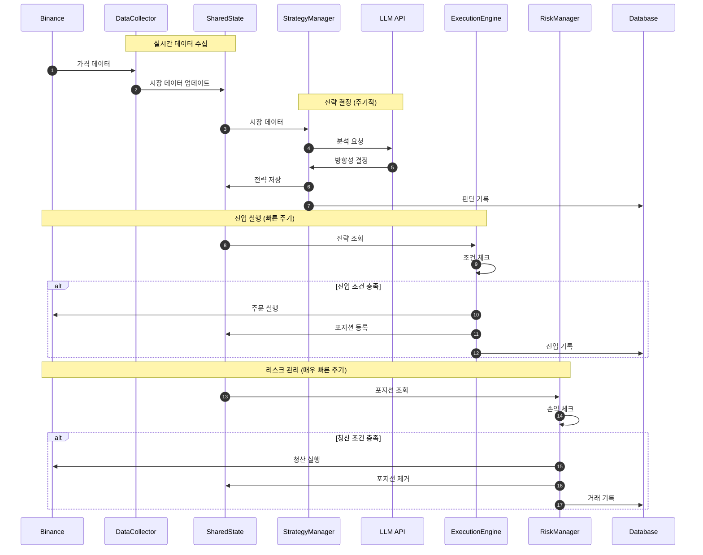

# AI Crypto Futures Trading Bot

LLM(대규모 언어 모델) 기반의 암호화폐 선물 자동매매 봇입니다. 바이낸스 선물 거래소와 연동하여 실시간으로 시장을 분석하고, AI가 결정한 전략에 따라 자동으로 매매를 실행합니다.

## 목차

- [주요 특징](#주요-특징)
- [아키텍처](#아키텍처)
- [기술 스택](#기술-스택)
- [버전 히스토리](#버전-히스토리)
- [핵심 컴포넌트](#핵심-컴포넌트)

---

## 주요 특징

- **AI 기반 방향성 결정**: 주기적으로 LLM이 시장 데이터를 분석하여 롱/숏/중립 방향 결정
- **규칙 기반 실시간 실행**: 짧은 주기로 진입 조건 체크, 조건 충족 시 즉시 시장가 진입
- **실시간 리스크 관리**: 매우 짧은 주기로 손절/익절/트레일링 스탑 모니터링
- **멀티 타임프레임 분석**: 여러 타임프레임 봉의 추세 정렬 확인
- **동적 포지션 사이징**: Fixed Risk % 기반, 변동성 및 신뢰도에 따라 조정

---

## 아키텍처



### 데이터 흐름



---

## 기술 스택

### 백엔드
| 기술 | 용도 |
|------|------|
| **Python** | 메인 언어 (3.10+) |
| **FastAPI** | REST API + WebSocket 서버 |
| **asyncio** | 비동기 멀티태스킹 |
| **aiohttp** | 비동기 HTTP 클라이언트 |

### 데이터 처리
| 기술 | 용도 |
|------|------|
| **pandas / pandas-ta** | 기술 지표 계산 |
| **numpy** | 수치 연산 |
| **SQLite** | 로컬 데이터베이스 |

### 거래소 연동
| 기술 | 용도 |
|------|------|
| **python-binance** | 바이낸스 REST API |
| **binance-connector** | WebSocket 스트림 |

### AI/LLM
| 기술 | 용도 |
|------|------|
| **OpenRouter API** | LLM 호출 게이트웨이 |
| **DeepSeek V3.2 Speciale** | 주 LLM 모델 |

### 인프라
| 기술 | 용도 |
|------|------|
| **AWS EC2** | 라이브 서버 |
| **GitHub Actions** | CI/CD 자동 배포 |
| **systemd** | 프로세스 관리 + 헬스체크 |

---

## 버전 히스토리

### v1 - 기본 LLM 트레이딩

**아키텍처:**
```
LLM → 즉시 매매 결정 (진입/청산 모두)
```

**특징:**
- LLM이 직접 매매 결정 (진입/청산 모두 LLM이 판단)
- 단순 손절/익절 비율 기반
- 고정 포지션 사이즈
- 단일 타임프레임 분석

**한계점:**
- LLM 응답 지연으로 빠른 시장 대응 어려움
- 규칙 기반 필터링 부족으로 잘못된 진입 발생
- 리스크 관리 미흡 (손절 누락, 과도한 포지션)
- LLM API 비용 높음 (매 틱마다 호출)

---

### v2 - LLM + 규칙 엔진 분리 아키텍처

**아키텍처:**
```
LLM (주기적) → 방향성만 결정 → 규칙 엔진 (빠른 주기) → 조건 충족 시 매매
```

**핵심 변경:**
- **역할 분리**: LLM은 주기적으로 방향성(롱/숏/중립)만 결정, 실제 매매는 규칙 엔진이 담당
- **실시간 실행**: ExecutionEngine이 짧은 주기로 진입 조건 체크
- **실시간 리스크**: RiskManager가 매우 짧은 주기로 손절/익절 체크

**주요 기능:**
- **StrategyManager**: 주기적으로 LLM 호출, 방향성 + 신뢰도 + 진입 조건 결정
- **ExecutionEngine**: 짧은 주기로 진입 조건 체크, 조건 충족 시 시장가 즉시 진입
- **RiskManager**: 매우 짧은 주기로 손절/익절 체크, 즉시 청산
- **SharedState**: 스레드 세이프 중앙 상태 관리
- **AI 판단 내역 DB 저장**: 모든 LLM 판단을 기록하여 분석 가능

**개선 효과:**
- LLM 호출 비용 대폭 감소 (매 틱 → 주기적 호출)
- 진입/청산 지연 제거 (LLM 응답 대기 → 규칙 기반 즉시 실행)
- 일관된 규칙 적용으로 예측 가능한 동작

---

### v2.1 - 고급 리스크 관리

**아키텍처:**
```
v2 + 트레일링 스탑 + 분할 익절 + 마켓 레짐 연동
```

**핵심 변경:**
- 단순 손절/익절 → 동적 리스크 관리 시스템

**주요 기능:**
- **트레일링 스탑**: 수익 구간 진입 시 활성화, ATR 기반 동적 조정
- **분할 익절**: 다단계 익절 목표, 단계별 부분 청산 후 나머지는 트레일링
- **마켓 레짐 연동**: 시장 상황(변동성, 추세, 횡보)에 따라 SL/TP/포지션 크기 동적 조정
- **볼륨 필터**: 거래량 기준 미달 시 진입 차단
- **연속 손실 제한**: 연속 손실 시 자동 쿨다운
- **청산 사유별 쿨다운**: 손절/익절/트레일링 등 사유에 따라 쿨다운 차등 적용

---

### v2.2 - 멀티 타임프레임 정렬

**아키텍처:**
```
v2.1 + 멀티 타임프레임 필수 정렬 + ATR 기반 SL/TP + 거래 통계 피드백
```

**핵심 변경:**
- 개별 타임프레임 체크 → 멀티 타임프레임 필수 정렬

**주요 기능:**
- **멀티 타임프레임 정렬**: 여러 타임프레임의 추세가 정렬되어야만 진입
- **ATR 기반 SL/TP**: 변동성에 따라 손절/익절 거리 자동 조정
- **동적 포지션 사이징**: 신뢰도, 마켓 레짐, 활성 포지션 수를 종합 반영
- **강한 추세 예외**: 강한 추세 시 과매수/과매도 조건 완화
- **거래 통계 피드백**: 최근 성과를 LLM 프롬프트에 포함, 저조한 성과 시 보수적 판단 유도

---

### v2.3 - 공격적 선물 트레이딩

**아키텍처:**
```
v2.2 + Fixed Risk % + 드로우다운 관리 + 자본 스케일링 + 펀딩비 반영
```

**핵심 변경:**
- 포지션 사이즈 % 기반 → Fixed Risk % 기반 (손절 거리 기준)

**주요 기능:**
- **Fixed Risk % 기반 포지션 사이징**: 손절 거리와 실제 거래 비용을 고려한 수량 산출
- **드로우다운 관리**: 일일/주간/월간/전체 기간별 손실 한도 초과 시 진입 중단
- **유동성 리스크 관리**: 자본 규모 대비 거래량 비율로 최대 포지션 제한
- **코인 간 상관관계 체크**: 높은 상관관계 코인 쌍의 동시 보유 방지
- **펀딩비 반영**: 정산 시간 전후 진입 회피, 방향에 따라 포지션 조정
- **동적 레버리지**: 변동성에 따라 레버리지 자동 조정
- **슬리피지/수수료 버퍼**: 실제 거래 비용을 포지션 계산에 반영
- **재시작 시 SL/TP 복원**: 봇 재시작 후에도 원래 손절/익절가 유지

---

### v2.4 - 하이브리드 전략 (기술적 분석 + LLM)

**아키텍처:**
```
기술적 분석 (방향 결정) + LLM (신뢰도 조정) + 레버리지 캡
```

**핵심 변경:**
- LLM이 방향성까지 결정 → 기술적 분석이 방향 결정, LLM은 신뢰도 조정 역할로 변경

**주요 기능:**
- **멀티 타임프레임 가중 점수 기반 방향 결정**: 타임프레임별 가중치를 부여하여 방향성 점수화
- **LLM 역할 변경**: 기술적 방향과 LLM 판단의 일치/불일치에 따라 신뢰도를 부스트 또는 페널티
- **레버리지 캡**: 손절 거리 기반으로 레버리지 상한 자동 계산, 손절이 반드시 강제청산보다 먼저 발동하도록 보장
- **예측 반전 시 조기 청산**: 다음 예측이 현재 포지션 반대 방향이면 즉시 청산

---

### v2.5 - 반등 감지 + 분할 익절 안정화 (현재 버전)

**아키텍처:**
```
v2.4 + 반등 감지 + ATR 레짐별 차등 TP/SL + reduceOnly 분할 청산
```

**핵심 변경:**
- 하락 추세에서도 반등 초기를 포착하여 진입
- 분할 익절 주문의 안정성 강화

**주요 기능:**
- **반등 감지 (Bounce Detection)**: 단기 타임프레임 전환 + 모멘텀 지표 조합으로 추세 전환 초기 포착
- **ATR 레짐별 차등 TP/SL**: 마켓 레짐(변동성, 추세, 횡보, 브레이크아웃)에 따라 익절 목표 거리 차등 적용
- **reduceOnly 분할 청산**: 분할 익절 시 거래소 최소 주문 금액 제한을 우회하여 소액 분할 청산도 안정적으로 처리
- **다단계 분할 익절**: 포지션을 여러 단계로 나누어 수익 확보 후 나머지는 트레일링 스탑으로 관리

---

## 핵심 컴포넌트

### StrategyManager (`src/core/strategy_manager.py`)
- 주기적으로 LLM 호출
- 시장 데이터 + 거래 기록 + 계좌 상태를 프롬프트로 변환
- LLM 응답 파싱 → StrategySet 생성 (각 코인별 방향성, 신뢰도, 진입 조건)
- AI 판단 내역 DB 저장

### ExecutionEngine (`src/core/execution_engine.py`)
- 짧은 주기로 진입 조건 체크
- 멀티 타임프레임 가중 점수 기반 방향 결정
- 기술 지표 조건 + 반등 감지
- Fixed Risk % 기반 수량 계산
- 유동성 상한, 펀딩비, 상관관계 체크
- 시장가 주문 실행
- 재시작 복원용 SL/TP DB 저장

### RiskManager (`src/core/risk_manager.py`)
- 고속 주기로 포지션 모니터링
- 예측 반전 시 조기 청산
- 다단계 분할 익절 + 트레일링 스탑
- reduceOnly 분할 청산
- 청산 시 거래 기록 저장

### SharedState (`src/core/shared_state.py`)
- Thread-safe 중앙 상태 관리
- 전략, 포지션, 시장 데이터, 계좌 정보
- 거래 기록 관리
- 마켓 레짐 캐시
- 드로우다운 관리 (일일/주간/월간/전체)

### DataCollector (`src/data_collector.py`)
- 바이낸스 WebSocket 가격 스트림
- 기술 지표 계산
- 멀티 타임프레임 데이터 수집
- 펀딩비 조회