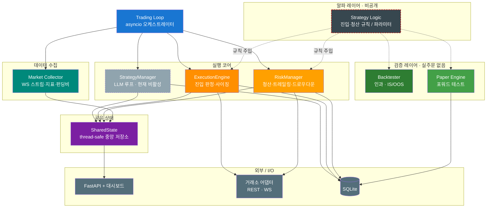
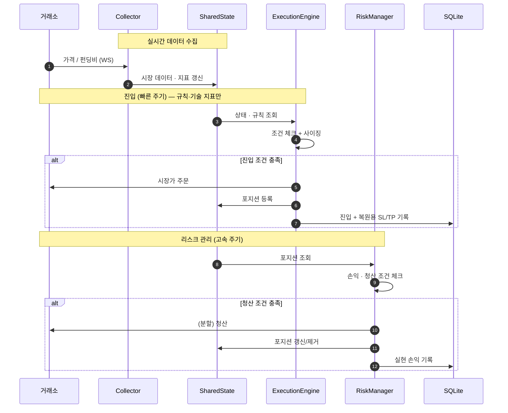
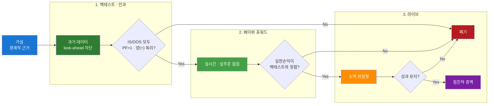

# AI 트레이딩 봇 — 엔지니어링 노트

[라이브 대시보드](http://3.39.23.98:8000)


개인용 암호화폐/주식 자동매매 시스템입니다. **LLM이 직접 매매를 결정하는 구조로 출발했지만**, 응답 지연·비용·환각으로 실시간 매매 판단에는 부적합하다고 판단해 그 루프를 제거했고, **현재는 규칙·기술 지표 기반으로 동작**합니다. (LLM 변천은 [진화 기록](#진화-기록) 참고)

이 저장소는 **소스 코드가 아니라 시스템의 설계·운영·검증 방식**을 문서로 남기는 곳입니다.

> ### 프로젝트 현황 
> - **개인 학습·리서치 목적의 실험 프로젝트**입니다.
> - **라이브 운용 결과는 누적 손실 상태**이며, 입증된 수익 엣지는 아직 없습니다.
> - 본 문서의 목적은 "어떻게 돈을 버는가"가 아니라 **"자동매매 시스템을 어떻게 설계하고, 위험을 통제하고, 가설을 검증했는가"**를 기록하는 것입니다.
> - 투자 조언이 아니며, 과거 성과는 미래를 보장하지 않습니다.

## 목차

- [아키텍처](#아키텍처)
- [저장소 구조](#저장소-구조)
- [데이터 흐름](#데이터-흐름)
- [검증 방법론](#검증-방법론)
- [기술 스택](#기술-스택)
- [진화 기록](#진화-기록)
- [핵심 컴포넌트](#핵심-컴포넌트)

---

## 아키텍처

LLM이 직접 매매하던 구조에서 출발했지만, 현재는 **규칙 기반 실행 + 검증 레이어**가 중심입니다. LLM 매매 루프는 제거되었고, 매매 판단에는 더 이상 참여하지 않습니다.



**설계 원칙**

- **알파와 인프라 분리** — 전략 로직은 교체 가능한 모듈로, 실행/리스크/검증 인프라는 전략과 무관하게 재사용.
- **빠른 실행, 느린 판단** — 무거운 분석은 주기적으로, 진입/청산 판정은 짧은 주기로 규칙 기반 즉시 실행. (과거 LLM 방향 판단이 이 자리였으나 지연·비용 문제로 제거)
- **검증 없이는 라이브 없음** — 모든 신규/수정 로직은 백테스트 → 페이퍼 → 소액 라이브 순으로만 자본에 닿음.

---

## 저장소 구조

> 실제 소스는 비공개 저장소에 있으며, 아래는 모듈 구성을 설명하기 위한 것입니다.

```
.
├── run_trading.py          # 트레이딩 루프 진입점
├── api_server.py           # FastAPI + 대시보드 진입점
├── config/                 # 버전·파라미터·프롬프트 설정
└── src/
    ├── core/               # 실행 코어 — 전략과 무관한 공통 인프라
    │   ├── execution_engine.py   #  진입 판정·포지션 사이징
    │   ├── risk_manager.py       #  청산·트레일링·드로우다운
    │   ├── live_risk.py          #  실시간 리스크 한도
    │   ├── shared_state.py       #  thread-safe 중앙 상태
    │   ├── sl_orders.py          #  손절 주문 관리
    │   ├── position_syncer.py    #  거래소 ↔ 로컬 포지션 동기화
    │   └── restart_reconcile.py  #  재시작 시 포지션/SL 복원
    ├── strategies/         # ⛔ 알파 (비공개) — 진입/청산 규칙
    ├── bots/               # 베뉴별 봇 오케스트레이션 (binance / okx / kis)
    ├── exchanges/          # 거래소 API 어댑터 (REST · WS)
    ├── market/             # 데이터 수집·지표·레짐·펀딩비
    ├── llm/                # LLM 클라이언트 (OpenRouter) — 현재 매매 비참여
    ├── paper_scalp/        # 페이퍼 트레이딩 엔진 (실주문 없음)
    ├── backtest/           # 인과 백테스트 데이터/엔진
    ├── analytics/          # 사후 거래 분석·리포트
    ├── notifications/      # Slack 알림
    └── models/             # 도메인 모델 (Position, Strategy 등)
```

핵심은 `core/`(인프라)와 `strategies/`(알파)의 경계입니다. 전략이 망가져도 인프라는 그대로 다른 전략을 검증·운영하는 데 쓰입니다.

---

## 데이터 흐름



---

## 검증 방법론

전략은 비공개이지만 **검증 방식은 공개**합니다. 신규/수정 로직은 라이브 투입 전 아래 3단계를 통과해야 합니다.



### 과적합 방지 원칙

| 원칙 | 적용 |
|------|------|
| **인과성 (미래 참조 금지)** | 판단 시점에 *아직 알 수 없는 미래·미완성 봉 데이터*를 쓰지 않음. 백테스트가 비현실적으로 좋아지는 걸 방지 |
| **IS / OOS 분리** | In-Sample으로 설계, Out-of-Sample으로만 채택 여부 결정 |
| **그리드 서치 금지** | 파라미터는 경제적 근거로 고정. 다중 시도로 인한 가짜 양성(selection bias) 차단 |
| **거래 비용 현실화** | 왕복 수수료·슬리피지 버퍼 반영, taker 기준 보수적 산정 |
| **레짐별 평가** | 상승/하락/횡보를 분리 집계해 특정 장세 의존도 노출 |
| **벤치마크 대비** | 단순 Buy & Hold 대비 초과수익(alpha)으로 가치 판단 |

### 페이퍼 트레이딩 (포워드 테스트)

후보 전략들을 **실주문 없이** 실시간 병렬 운용하고, 전략 로직(TP/SL/시간청산)이 닫은 **확정 손익**만 기록합니다.

- 평가손익(mark-to-market)이 아닌 **로직이 청산한 실현손익**만 집계 → 장세 상승에 의한 착시 제거
- 전략별 승률·PF·청산 사유 분포를 대시보드에서 추적
- 백테스트(과거) ↔ 페이퍼(현재) 정합성으로 룩어헤드/구현 오류 교차 검증

> 이 검증 단계는 **수익을 보장하지 못합니다.** 다만 *나쁜 가설을 라이브 전에 걸러내는* 데는 실제로 작동했습니다. 검증의 주된 산출물은 "통과한 전략"이 아니라 **"폐기된 전략"**입니다.

---

## 기술 스택

| 영역 | 사용 기술 |
|------|-----------|
| **언어 / 런타임** | Python 3.10+, asyncio |
| **API 서버** | FastAPI, WebSocket, aiohttp |
| **데이터 처리** | pandas, pandas-ta, numpy |
| **저장소** | SQLite |
| **거래소 연동** | python-binance, binance-connector, OKX / KIS REST·WS |
| **LLM** | OpenRouter (DeepSeek / Qwen) — 초기 매매 판단에 사용, 현재는 제거되어 비활성 |
| **개발** | Claude Code, Cursor |
| **인프라** | AWS EC2, systemd (프로세스·헬스체크), GitHub Actions (CI/CD) |

---

## 진화 기록

LLM 단독 매매에서 출발해 규칙 기반 + 검증 중심으로 옮겨온 과정입니다. **각 단계가 수익을 의미하지는 않습니다** — 대부분은 "직전 방식이 잘 안 돼서" 바꾼 기록입니다.

| 단계 | 도입한 것 | 배운 점 |
|------|-----------|---------|
| **LLM 직접 매매** | LLM이 진입·청산을 직접 결정 | 응답 지연·비용·일관성 부족으로 실시간 매매에 부적합 |
| **판단 / 실행 분리** | LLM은 주기적 방향성만, 규칙 엔진이 실시간 실행 | 비용·지연 감소, 동작 예측 가능 |
| **리스크 관리** | 트레일링 스탑·분할 익절·레짐 연동 | 리스크 관리가 신호만큼 중요 |
| **멀티 타임프레임** | 타임프레임 추세 정렬 필수화 | 노이즈 진입 감소, 거래 빈도↓ |
| **비용 · 생존 관리** | Fixed Risk % 사이징·드로우다운 한도·펀딩비 반영 | 비용·생존이 수익률보다 먼저 |
| **규칙 기반 전환** | 방향 판단을 규칙으로 이전, **LLM 매매 루프 제거** | LLM의 방향 예측 정확도·지연·비용이 실시간 매매에 부적합 → 규칙의 일관성이 운용에 유리 |
| **멀티 베뉴 확장** | 거래소 어댑터 분리, 복수 베뉴·자산군 추상화 | 인프라와 전략의 분리가 확장의 전제 |
| **검증 파이프라인 도입** | 페이퍼 트레이딩 + 인과 백테스트 + 신호 검증 대시보드 | 백테스트만으론 부족, 실시간 포워드 검증이 필요 |
| **검증 우선 운영 (현재)** | 신규 전략은 검증 통과 전 라이브 금지 | 단순 기술적 전략으로 수수료를 이기는 안정적 엣지는 아직 미발견 → 무작정 라이브 대신 **검증으로 빠르게 거르는 단계** |

> **현재 상태 요약:** 누적 손익은 마이너스이고 입증된 엣지는 아직 없습니다. 개발은 멈추지 않았으며(앞서 본 검증 레이어가 그 결과), 현재는 *새 전략을 검증 단계에서 빠르게 검증·폐기하는 규율*에 집중하는 단계입니다. 이건 "완성된 수익 기계"가 아니라 **진행 중인 리서치**입니다.

---

## 핵심 컴포넌트

### ExecutionEngine (`src/core/execution_engine.py`)
짧은 주기로 진입 조건을 평가하고, Fixed Risk % 기반 수량을 산출해 시장가 주문을 실행합니다. 유동성 상한·펀딩비·상관관계 체크 및 재시작 복원용 SL/TP 기록을 담당합니다. (구체적 진입 규칙은 비공개)

### RiskManager (`src/core/risk_manager.py`)
고속 주기로 포지션을 모니터링하며 손절/익절/트레일링 스탑, 다단계 분할 청산(reduceOnly), 예측 반전 시 조기 청산을 수행하고 실현 손익을 기록합니다.

### SharedState (`src/core/shared_state.py`)
전략·포지션·시장 데이터·계좌 상태·레짐 캐시·드로우다운(일/주/월/전체)을 보관하는 thread-safe 중앙 저장소.

### Market Collector (`src/market/`)
거래소 WebSocket 가격 스트림, 멀티 타임프레임 지표 계산, 펀딩비 조회, 레짐 판정.

### Paper Engine (`src/paper_scalp/`)
실주문 없이 후보 전략을 실시간 운용하며 전략 로직대로 청산된 확정 손익을 기록하는 페이퍼 트레이딩 엔진.

### Backtester (`src/backtest/`)
인과(look-ahead 차단) 백테스트. IS/OOS 분리, 거래 비용 반영, 레짐별·벤치마크 대비 평가.

---

*이 문서는 시스템의 엔지니어링 기록입니다. 수익을 약속하지 않으며, 어떤 종류의 투자 권유도 아닙니다.*
